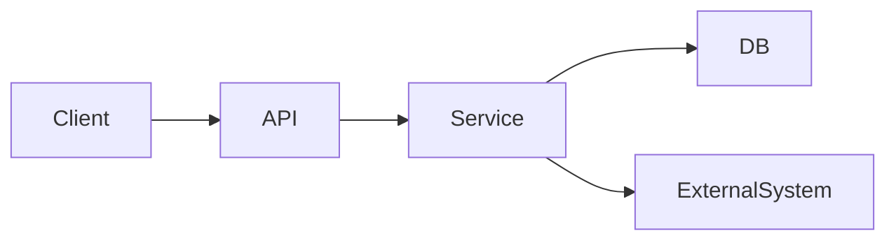
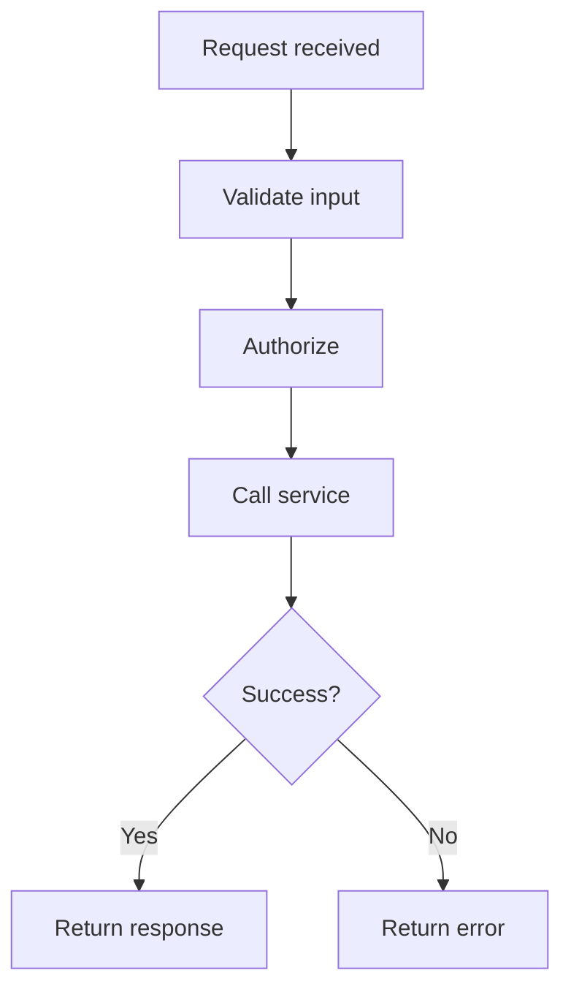
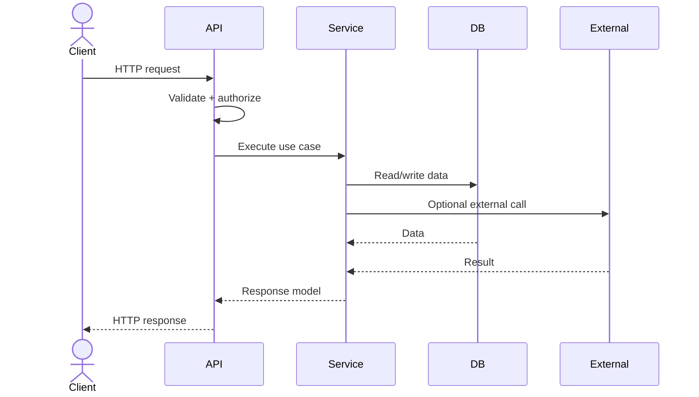

# <System Name>

## 1. Summary
- Purpose:
- Primary users/consumers:
- Main capabilities:
- Tech stack:
- External integrations:

## 2. Description
Short 1-3 paragraph explanation of what the system does, its boundaries, and how requests move through it.

## 3. Endpoint Details

| Endpoint | Method | Purpose | Auth | Request | Response | Dependencies | Notes |
|---|---|---|---|---|---|---|---|
| /api/... | GET/POST | ... | ... | ... | ... | ... | ... |

## 4. Architecture Diagram

## 5. Subsystem Details

| Subsystem | Responsibility | Key Modules/Files | Inputs | Outputs | Dependencies |
|---|---|---|---|---|---|
| API Layer | Accepts requests | routes/, controllers/ | HTTP requests | DTO/commands | Service layer |

## 6. Journey Flow – <Endpoint or Use Case Name>

## 7. Sequence Diagram – <Endpoint or Use Case Name>

