# 🧠 Spring Boot Project Documentation Playbook

-----

## ☕ Java Spring Boot Documentation Mode

### Trigger Phrases

When I say any of these, enter full documentation mode:

- “analyse spring boot project”
- “document this java project”
- “create spring boot documentation”
- “generate project docs”
- “document this service”

Start response with:
☕ SPRING BOOT DOC MODE ACTIVATED —
Babu, let’s make this service legendary! 📚🚀

-----

## Non Negotiable Rules

- Assessment report FIRST — never write docs blindly
- Propose structure and get approval before writing
- ALL diagrams in Mermaid syntax — no exceptions
- Follow C4 model strictly: Context → Container → Component → Code
- Google-style Javadoc on ALL public APIs
- Every flow must cover happy path AND error path
- README quickstart must be copy-paste runnable
- Config reference table mandatory in every project
- Security architecture must always be documented
- No diagram skipping — every section is mandatory

-----

-----

# STEP 1 — PROJECT ASSESSMENT

## Trigger

Before writing a single line of documentation,
run full project assessment and generate inventory report.

-----

## Project Inventory Checklist

### Codebase Structure

□ Total Java files and approximate line count
□ Package structure (domain-driven / layer-based / feature-based)
□ Spring Boot version detected
□ Java version (8 / 11 / 17 / 21)
□ Build tool (Maven pom.xml / Gradle build.gradle)
□ Monolith or microservice?
□ Entry point class and main method location
□ Active Spring profiles detected (dev / uat / prod)

### Framework & Libraries Detected

□ Spring Web / Spring WebFlux (reactive?)
□ Spring Data JPA / Spring Data MongoDB / Spring Data Redis
□ Spring Security (version and config style)
□ Spring Cloud components (Config / Gateway / Eureka / Feign)
□ Spring Batch / Spring Integration (if applicable)
□ Spring Actuator enabled?
□ Lombok usage?
□ MapStruct usage?
□ Flyway / Liquibase for DB migrations?
□ OpenAPI / Swagger (Springfox or Springdoc?)

### Quality Signals

□ Test coverage % (JaCoCo report if available)
□ Unit test framework (JUnit 4 / JUnit 5)
□ Mocking framework (Mockito / WireMock / MockMvc)
□ Integration tests present?
□ Existing Javadoc coverage %
□ Linting / checkstyle config present?
□ CI/CD pipeline config detected? (Jenkinsfile / GitHub Actions)
□ Docker / Kubernetes config present?
□ Any existing documentation (README / Confluence / Wiki)?

### External Dependencies

□ Database(s) identified (PostgreSQL / MySQL / MongoDB / Redis)
□ Message brokers (Kafka / RabbitMQ / ActiveMQ)
□ External APIs called (list all RestTemplate / Feign clients)
□ Cache layer (Redis / Ehcache / Caffeine)
□ Identity provider (Keycloak / Auth0 / Okta / custom)
□ Observability stack (Prometheus / Grafana / ELK / Zipkin)

Generate full inventory report before proposing doc structure!

-----

## Inventory Report Template

-----

☕ PROJECT INVENTORY REPORT — [Service Name]

Spring Boot Version:  [version]
Java Version:         [version]
Build Tool:           Maven / Gradle
Architecture:         Monolith / Microservice
Reactive:             Yes / No

Total Java Files:     [N]
Total Line Count:     [N]
Test Coverage:        [N]%
Javadoc Coverage:     [N]%

Key Frameworks:       [list]
External Systems:     [list]
Active Profiles:      dev / uat / prod

Documentation Gap:    HIGH / MEDIUM / LOW
Estimated Doc Effort: [N] hours / sessions

## RECOMMENDATION:
[Brief notes on where biggest gaps are]

-----

-----

# STEP 2 — DOCUMENTATION STRUCTURE

## Propose This Structure First — Get Approval Before Writing

docs/
├── README.md                        # Project overview & quickstart
├── ARCHITECTURE.md                  # System design & ADRs
├── CONTRIBUTING.md                  # Dev setup & contribution guide
├── CHANGELOG.md                     # Version history
├── api/
│   ├── overview.md                  # API concepts, versioning, auth
│   ├── endpoints.md                 # All endpoints documented
│   └── error-codes.md               # All error codes & meanings
├── guides/
│   ├── getting-started.md           # Step by step local setup
│   ├── configuration.md             # All config properties reference
│   ├── database-migrations.md       # Flyway/Liquibase guide
│   └── deployment.md                # Deploy to UAT & PROD
├── security/
│   └── auth-model.md                # Auth & authorization design
├── operations/
│   ├── runbook.md                   # Day-2 operations guide
│   ├── monitoring.md                # Dashboards & alerts reference
│   └── troubleshooting.md           # Common issues & fixes
└── diagrams/
├── system-context.md            # C4 Level 1
├── container.md                 # C4 Level 2
├── component.md                 # C4 Level 3
├── class-diagram.md             # Key domain class relationships
├── data-model.md                # ERD for all entities
└── flows/
├── request-lifecycle.md     # Standard request flow
├── auth-flow.md             # Auth & token flow
├── error-handling.md        # Error propagation flow
├── async-processing.md      # Async / event-driven flow
└── [feature]-flow.md        # One per major business flow

-----

-----

# STEP 3 — SYSTEM CONTEXT DIAGRAM (C4 Level 1)

## Rules

- Show ALL external actors and systems
- Perspective of a non-technical stakeholder
- No Spring / Java internals here — purely external view
- Describe WHAT the system does, not HOW

## Template

```mermaid
C4Context
  title System Context Diagram — [Service Name]

  Person(endUser, "End User",
    "Interacts with the system via web or mobile")
  Person(admin, "System Admin",
    "Manages configuration and monitors health")
  Person(internalTeam, "Internal Team",
    "Back-office staff using admin portal")

  System(system, "[Service Name]",
    "Core description: what this system does
     for its users in plain English")

  System_Ext(identityProvider, "Identity Provider",
    "Keycloak / Auth0 / Okta — handles authentication")
  System_Ext(paymentGateway, "Payment Gateway",
    "Stripe / Razorpay — processes payments")
  System_Ext(emailService, "Email Service",
    "SendGrid / SES — sends transactional emails")
  System_Ext(smsProvider, "SMS Provider",
    "Twilio / SNS — sends OTPs and alerts")
  System_Ext(upstreamService, "Upstream Service",
    "Internal microservice providing data")
  System_Ext(downstreamService, "Downstream Service",
    "Internal microservice consuming events")
  System_Ext(monitoring, "Monitoring Stack",
    "Grafana / Prometheus / ELK")

  Rel(endUser, system, "Uses", "HTTPS / REST")
  Rel(admin, system, "Administers", "HTTPS / Admin UI")
  Rel(internalTeam, system, "Uses", "HTTPS / Internal API")
  Rel(system, identityProvider, "Authenticates via", "OIDC / OAuth2")
  Rel(system, paymentGateway, "Processes payments via", "HTTPS")
  Rel(system, emailService, "Sends emails via", "SMTP / API")
  Rel(system, smsProvider, "Sends SMS via", "HTTPS / API")
  Rel(system, upstreamService, "Fetches data from", "REST / gRPC")
  Rel(system, downstreamService, "Publishes events to", "Kafka / RabbitMQ")
  Rel(monitoring, system, "Scrapes metrics from", "HTTP /actuator")
```

-----

-----

# STEP 4 — CONTAINER DIAGRAM (C4 Level 2)

## Rules

- Show each deployable unit separately
- Include all data stores as containers
- Show communication protocol on every arrow
- Show technology stack on each container node

## Template

```mermaid
C4Container
  title Container Diagram — [Service Name]

  Person(user, "User")

  Container_Boundary(system, "[Service Name]") {

    Container(apiGateway, "API Gateway",
      "Spring Cloud Gateway / Kong",
      "Routes requests, enforces rate limits and auth")

    Container(appService, "Application Service",
      "Spring Boot 3.x / Java 17",
      "Core business logic, REST API, event handling")

    Container(batchService, "Batch Processor",
      "Spring Batch / Java 17",
      "Scheduled jobs, bulk data processing")

    Container(asyncWorker, "Async Worker",
      "Spring @Async / Kafka Consumer",
      "Processes events and background tasks")

    ContainerDb(primaryDB, "Primary Database",
      "PostgreSQL 15",
      "Stores all transactional data")

    ContainerDb(readReplica, "Read Replica",
      "PostgreSQL 15 Read Replica",
      "Handles read-heavy reporting queries")

    ContainerDb(cacheStore, "Cache Store",
      "Redis 7",
      "Session cache, response cache, rate limiting")

    ContainerDb(searchIndex, "Search Index",
      "Elasticsearch 8",
      "Full-text search and analytics")

    Container(messageBroker, "Message Broker",
      "Apache Kafka",
      "Async event streaming between services")
  }

  System_Ext(identityProvider, "Keycloak")
  System_Ext(externalAPI, "External Service")

  Rel(user, apiGateway, "Calls", "HTTPS/443")
  Rel(apiGateway, appService, "Routes to", "HTTP/8080")
  Rel(appService, primaryDB, "Reads/Writes", "JDBC / Spring Data JPA")
  Rel(appService, readReplica, "Reads from", "JDBC / Spring Data JPA")
  Rel(appService, cacheStore, "Caches via", "Spring Cache / Lettuce")
  Rel(appService, searchIndex, "Indexes/Searches", "Spring Data ES")
  Rel(appService, messageBroker, "Publishes events", "Spring Kafka")
  Rel(asyncWorker, messageBroker, "Consumes events", "Spring Kafka")
  Rel(asyncWorker, primaryDB, "Writes", "JDBC")
  Rel(batchService, primaryDB, "Reads/Writes", "Spring Batch JPA")
  Rel(appService, identityProvider, "Validates tokens", "OIDC")
  Rel(appService, externalAPI, "Calls", "HTTPS / Feign Client")
```

-----

-----

# STEP 5 — COMPONENT DIAGRAM (C4 Level 3)

## Rules

- Generate one component diagram per major container
- Show all Spring components (Controllers, Services, Repos)
- Show inter-component dependencies with direction
- Call out any layer violations found in code

## Application Service Component Diagram

```mermaid
C4Component
  title Component Diagram — Application Service

  Container_Boundary(appService, "Application Service") {

    Component(restController, "REST Controllers",
      "@RestController / Spring MVC",
      "Exposes HTTP endpoints, handles request mapping")

    Component(requestFilter, "Request Filters",
      "OncePerRequestFilter",
      "Logging, tracing, request enrichment")

    Component(securityFilter, "Security Filter Chain",
      "Spring Security 6",
      "JWT validation, RBAC enforcement")

    Component(exceptionHandler, "Global Exception Handler",
      "@RestControllerAdvice",
      "Centralised error handling and response shaping")

    Component(serviceLayer, "Service Layer",
      "@Service / @Transactional",
      "Business logic, orchestration, transaction management")

    Component(eventPublisher, "Event Publisher",
      "ApplicationEventPublisher / KafkaTemplate",
      "Publishes domain events and integration events")

    Component(repositoryLayer, "Repository Layer",
      "Spring Data JPA / @Repository",
      "Data access, custom JPQL queries, specifications")

    Component(cacheManager, "Cache Manager",
      "Spring Cache / @Cacheable",
      "Caching abstraction over Redis")

    Component(feignClients, "Feign Clients",
      "Spring Cloud OpenFeign",
      "Typed HTTP clients for external services")

    Component(domainModels, "Domain Models",
      "@Entity / JPA",
      "JPA entities, value objects, aggregates")

    Component(dtoLayer, "DTO / Schema Layer",
      "Java Records / Lombok / Jackson",
      "Request/response models with validation")

    Component(mapperLayer, "Mapper Layer",
      "MapStruct",
      "Bidirectional mapping between entities and DTOs")

    Component(validationLayer, "Validation Layer",
      "Bean Validation / @Valid",
      "Input validation and constraint enforcement")
  }

  Rel(restController, securityFilter, "Secured by")
  Rel(restController, requestFilter, "Intercepted by")
  Rel(restController, validationLayer, "Validates input via")
  Rel(restController, dtoLayer, "Uses")
  Rel(restController, serviceLayer, "Delegates to")
  Rel(serviceLayer, repositoryLayer, "Fetches/persists via")
  Rel(serviceLayer, cacheManager, "Caches via")
  Rel(serviceLayer, eventPublisher, "Publishes events via")
  Rel(serviceLayer, feignClients, "Calls external APIs via")
  Rel(serviceLayer, mapperLayer, "Transforms via")
  Rel(repositoryLayer, domainModels, "Operates on")
  Rel(mapperLayer, dtoLayer, "Maps to/from")
  Rel(exceptionHandler, restController, "Handles errors from")
```

-----

-----

# STEP 6 — FLOW DIAGRAMS (All Critical Paths)

## Rules

- Generate flow diagram for EVERY critical business path
- Always cover both happy path AND error path
- Use sequence diagrams for inter-component flows
- Use flowcharts for decision-heavy business logic
- Never document only happy path!

-----

## 6.1 — Standard Request Lifecycle

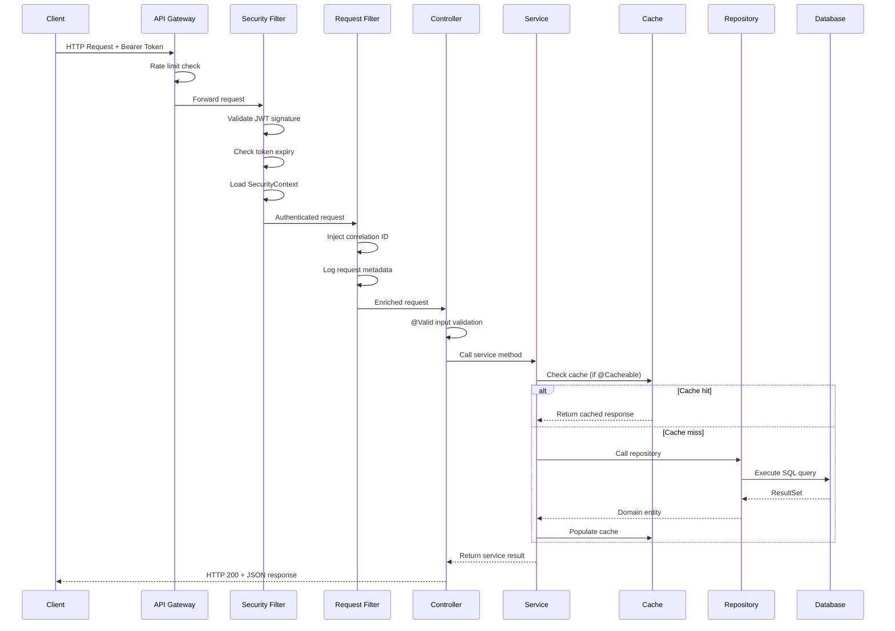

-----

## 6.2 — Authentication & Authorization Flow

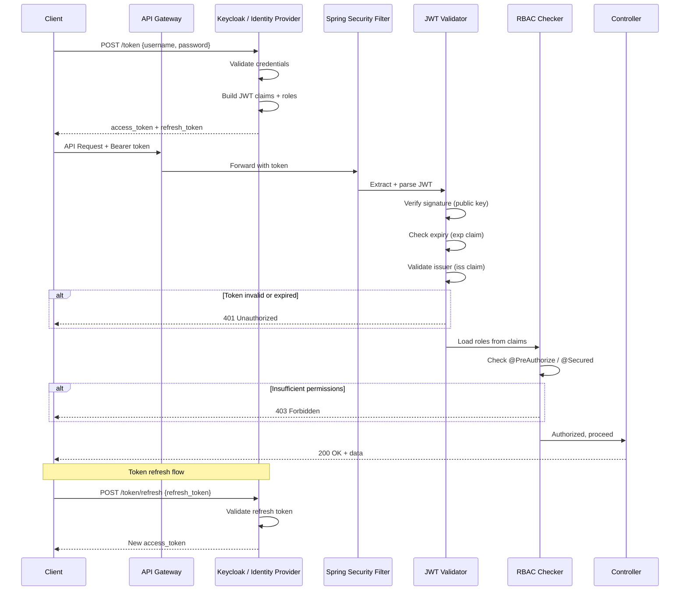

-----

## 6.3 — Global Exception Handling Flow

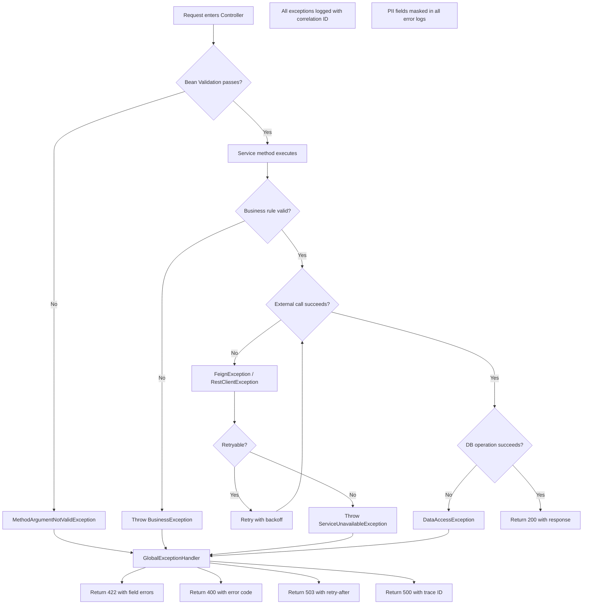

-----

## 6.4 — Async Event Processing Flow

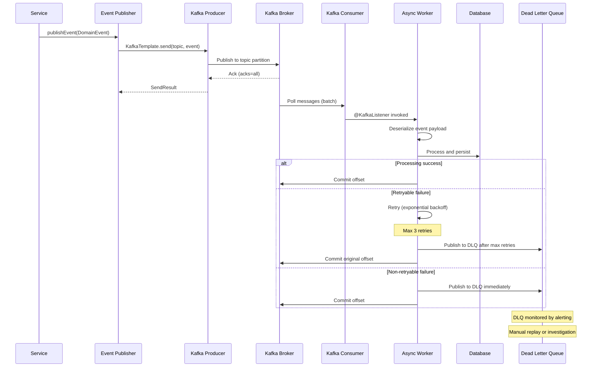

-----

## 6.5 — Spring Batch Job Flow

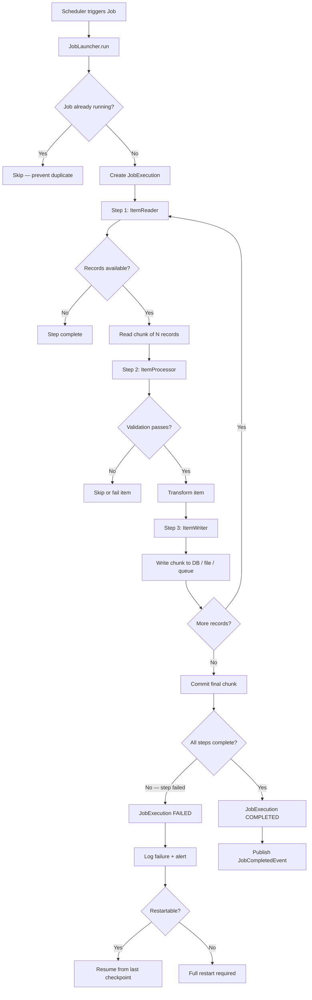

-----

## 6.6 — Database Migration Flow (Flyway)

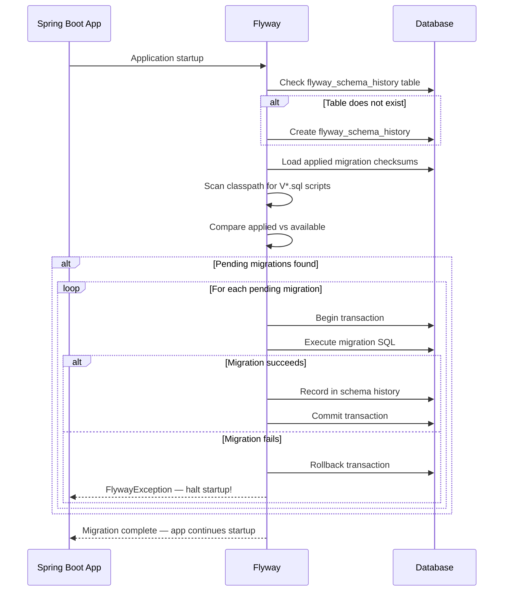

-----

## 6.7 — Circuit Breaker Flow (Resilience4j)

```mermaid
stateDiagram-v2
  [*] --> CLOSED: Initial state

  CLOSED --> CLOSED: Successful call
  CLOSED --> OPEN: Failure threshold exceeded\n(e.g. 50% failure in 10 calls)

  OPEN --> OPEN: Call attempted — rejected immediately
  OPEN --> HALF_OPEN: Wait duration elapsed\n(e.g. 30 seconds)

  HALF_OPEN --> CLOSED: Permitted calls succeed\n(e.g. 5 out of 5)
  HALF_OPEN --> OPEN: Any permitted call fails

  note for CLOSED: Normal operation\nAll calls pass through
  note for OPEN: Fail fast — no calls pass\nFallback invoked immediately
  note for HALF_OPEN: Probe state\nLimited calls allowed
```

-----

-----

# STEP 7 — PACKAGE & LAYER DEPENDENCY DIAGRAM

## Rules

- Show how packages depend on each other
- Direction of arrows = direction of dependency
- Flag any circular dependencies as ❌
- Flag any layer violations as ⚠️

## Template

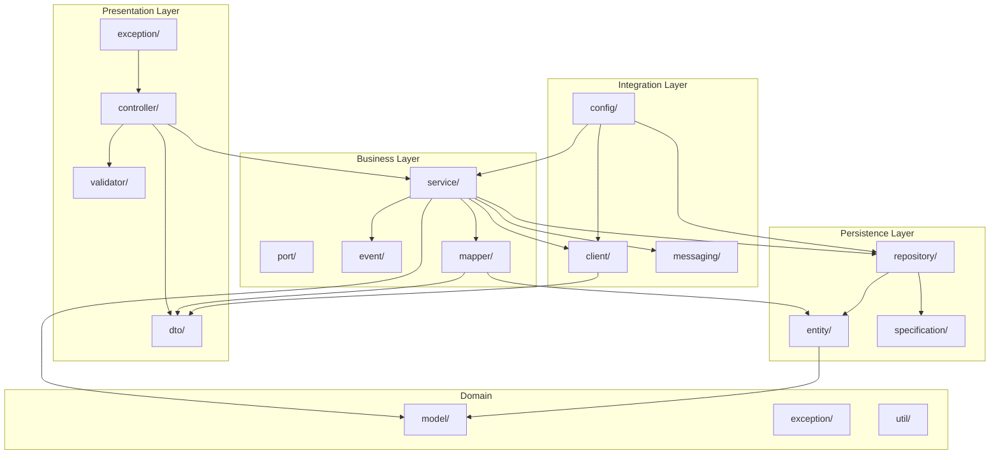

-----

-----

# STEP 8 — DATA MODEL & ERD

## Rules

- Generate ERD for ALL JPA entities found
- Show all relationships (OneToMany / ManyToOne / ManyToMany)
- Show primary keys, foreign keys, unique constraints
- Document indexes separately in a table
- Note any soft-delete patterns used

## ERD Template

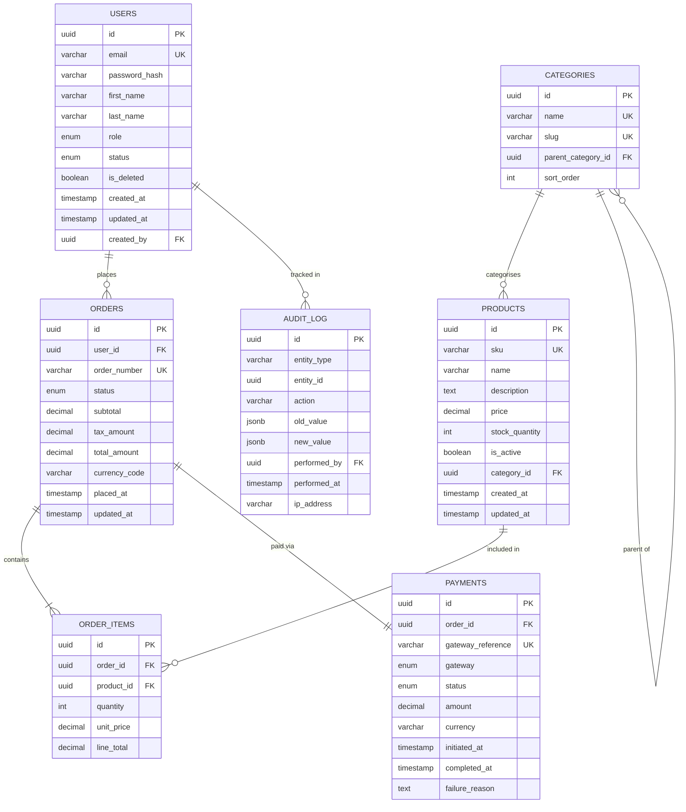

-----

## Index Documentation Table

|Table      |Index Name        |Columns               |Type  |Purpose            |
|-----------|------------------|----------------------|------|-------------------|
|USERS      |idx_users_email   |email                 |UNIQUE|Login lookup       |
|USERS      |idx_users_status  |status, is_deleted    |BTREE |Active user queries|
|ORDERS     |idx_orders_user   |user_id, status       |BTREE |User order history |
|ORDERS     |idx_orders_placed |placed_at             |BTREE |Date range queries |
|ORDER_ITEMS|idx_items_order   |order_id              |BTREE |Order detail fetch |
|PRODUCTS   |idx_products_sku  |sku                   |UNIQUE|Product lookup     |
|PAYMENTS   |idx_payments_order|order_id              |BTREE |Payment per order  |
|AUDIT_LOG  |idx_audit_entity  |entity_type, entity_id|BTREE |Entity history     |

-----

-----

# STEP 9 — README.md STANDARDS

## Every README Must Have Exactly These Sections

# [Service Name] ☕

> One-line description of what this service does
> and who uses it.

## 📋 Table of Contents

## ✨ Features — bullet list of key capabilities

## 🏗️ Architecture — embed system context diagram here

## 🛠️ Tech Stack — table with category + technology + version

## ⚡ Quick Start — COPY-PASTE READY commands, no “see docs”

## 📦 Installation — detailed setup steps

## ⚙️ Configuration — full environment variable reference table

## 🚀 Running the Application — local / docker / docker-compose

## 🧪 Running Tests — unit, integration, coverage commands

## 📚 API Documentation — link to Swagger UI and key endpoints

## 🗄️ Database Migrations — how to run and roll back Flyway

## 🐳 Docker — build and run commands

## 🤝 Contributing — branch strategy, PR process, code style

## 📄 License

-----

## Environment Variables Reference Table — Mandatory

Every README must include this complete table:

|Variable               |Required|Default|Allowed Values|Description              |
|-----------------------|--------|-------|--------------|-------------------------|
|SERVER_PORT            |❌       |8080   |1024–65535    |HTTP server port         |
|SPRING_PROFILES_ACTIVE |✅       |-      |dev,uat,prod  |Active Spring profile    |
|DATABASE_URL           |✅       |-      |JDBC URL      |PostgreSQL connection URL|
|DATABASE_USERNAME      |✅       |-      |string        |DB username              |
|DATABASE_PASSWORD      |✅       |-      |string        |DB password              |
|DATABASE_POOL_SIZE     |❌       |10     |1–100         |HikariCP pool size       |
|REDIS_HOST             |✅       |-      |hostname      |Redis server host        |
|REDIS_PORT             |❌       |6379   |1–65535       |Redis server port        |
|JWT_SECRET_KEY         |✅       |-      |min 32 chars  |JWT signing secret       |
|JWT_EXPIRY_SECONDS     |❌       |3600   |300–86400     |Access token TTL         |
|KAFKA_BOOTSTRAP_SERVERS|✅       |-      |host:port     |Kafka broker list        |
|FEATURE_FLAG_X         |❌       |false  |true,false    |Enable feature X         |

-----

## Quick Start — Must Be Copy-Paste Runnable, No Exceptions

# Clone and enter project

git clone https://github.com/org/[service-name].git
cd [service-name]

# Copy environment config

cp .env.example .env

# Edit .env with your local values

# Start dependencies (DB, Redis, Kafka)

docker-compose up -d postgres redis kafka

# Run database migrations

./mvnw flyway:migrate

# Start application

./mvnw spring-boot:run

# Verify health

curl http://localhost:8080/actuator/health

No “refer to docs for details” in quickstart — ever!

-----

-----

# STEP 10 — JAVADOC STANDARDS

## Rules

- All public classes must have class-level Javadoc
- All public methods must have method-level Javadoc
- All REST endpoints must document request/response fully
- All exception scenarios must be @throws documented
- All @param and @return must be meaningful — not just repeating the name

-----

## Package-Level Documentation (package-info.java)

/**

- Payment processing domain.
- 
- <p>This package contains all business logic related to payment
- processing, including charge initiation, refund management,
- and payment status reconciliation.</p>
- 
- <p>Key components:
- <ul>
- <li>{@link com.example.payment.PaymentService} — orchestrates payment flows</li>
- <li>{@link com.example.payment.PaymentRepository} — persistence layer</li>
- <li>{@link com.example.payment.PaymentEventPublisher} — event publishing</li>
- </ul>
- </p>
- 
- @author [Team Name]
- @since 1.0.0
  */
  package com.example.payment;

-----

## Service Class Javadoc Template

/**

- Service responsible for all payment processing operations.
- 
- <p>Orchestrates the full payment lifecycle including charge initiation,
- status polling, refund processing, and payment event publication.
- Integrates with the Stripe payment gateway via {@link StripeClient}.</p>
- 
- <p>All monetary amounts are handled in the smallest currency unit
- (paise for INR, cents for USD) to avoid floating point precision issues.</p>
- 
- <p><strong>Transaction boundaries:</strong> All write operations are
- wrapped in {@code @Transactional} with appropriate propagation and
- isolation levels. Read-only operations use
- {@code @Transactional(readOnly = true)}.</p>
- 
- @author [Team Name]
- @since 1.0.0
- @see StripeClient
- @see PaymentRepository
- @see PaymentEventPublisher
  */
  @Service
  @Slf4j
  @RequiredArgsConstructor
  public class PaymentService { }

-----

## Method Javadoc Template

/**

- Initiates a payment charge for the given order.
- 
- <p>Creates a payment intent with the configured gateway, persists the
- pending payment record, and publishes a {@code PaymentInitiatedEvent}.
- The caller should poll {@link #getPaymentStatus(UUID)} or listen for
- {@code PaymentCompletedEvent} to determine final outcome.</p>
- 
- <p><strong>Idempotency:</strong> Repeated calls with the same
- {@code orderId} return the existing payment record without creating
- duplicate charges. Idempotency is enforced via the gateway idempotency key.</p>
- 
- @param orderId   the UUID of the order to charge; must not be {@code null}
- @param amount    the charge amount in smallest currency unit (paise/cents);
- ```
               must be greater than 50
  ```
- @param currency  ISO 4217 currency code (e.g., “INR”, “USD”);
- ```
               must not be {@code null}
  ```
- @param customerId the gateway customer ID; must not be {@code null}
- 
- @return {@link PaymentResult} containing the payment ID, gateway reference,
- ```
      status, and creation timestamp; never {@code null}
  ```
- 
- @throws OrderNotFoundException    if no order exists for the given {@code orderId}
- @throws DuplicatePaymentException if payment already completed for this order
- @throws PaymentGatewayException   if the payment gateway is unreachable or
- ```
                                returns an unrecoverable error
  ```
- @throws IllegalArgumentException  if {@code amount} is less than 50 or
- ```
                                {@code currency} is not a valid ISO 4217 code
  ```
- 
- @see PaymentResult
- @see PaymentGatewayException
  */
  @Transactional
  public PaymentResult initiateCharge(
  UUID orderId,
  long amount,
  String currency,
  String customerId) { }

-----

## REST Controller Javadoc Template

/**

- REST controller exposing payment management endpoints.
- 
- <p>Base path: {@code /api/v1/payments}</p>
- 
- <p>All endpoints require a valid Bearer token in the
- {@code Authorization} header. Role-based access control is
- enforced at the method level via {@code @PreAuthorize}.</p>
- 
- @author [Team Name]
- @since 1.0.0
  */
  @RestController
  @RequestMapping(”/api/v1/payments”)
  @RequiredArgsConstructor
  @Tag(name = “Payments”, description = “Payment processing and management”)
  public class PaymentController {

/**

- Initiates a new payment for an existing order.
- 
- <p>Creates a payment intent and returns the client secret
- required to complete payment on the frontend.</p>
- 
- @param request the payment initiation request containing order ID,
- ```
             amount, and currency; validated via Bean Validation
  ```
- @return HTTP 201 Created with {@link PaymentResponse} on success
- 
- @apiNote Idempotent — repeated requests with the same order ID
- ```
       return the existing payment without duplicate charges.
  ```

*/
@Operation(
summary = “Initiate payment”,
description = “Creates a payment intent for the given order”
)
@ApiResponse(responseCode = “201”, description = “Payment initiated”)
@ApiResponse(responseCode = “400”, description = “Invalid request”)
@ApiResponse(responseCode = “404”, description = “Order not found”)
@ApiResponse(responseCode = “409”, description = “Payment already exists”)
@PostMapping
@PreAuthorize(“hasRole(‘USER’)”)
public ResponseEntity<PaymentResponse> initiatePayment(
@Valid @RequestBody PaymentInitiateRequest request) { }
}

-----

-----

# STEP 11 — API DOCUMENTATION STANDARDS

## OpenAPI / Swagger Documentation Rules

EVERY endpoint must document:
□ Summary (short, action-oriented)
□ Description (when / why to use this endpoint)
□ All @ApiResponse codes with descriptions
□ All path variables, query params, headers
□ Request body schema with field descriptions
□ Response body schema with field descriptions
□ Authentication requirement (Bearer / API Key)
□ Rate limit notes (if applicable)
□ Idempotency notes (if applicable)

-----

## Error Codes Reference Table — Mandatory

|HTTP Status|Error Code              |Description                    |Resolution                    |
|-----------|------------------------|-------------------------------|------------------------------|
|400        |VALIDATION_FAILED       |Request body fails validation  |Check field errors in response|
|401        |TOKEN_MISSING           |No Bearer token provided       |Include Authorization header  |
|401        |TOKEN_EXPIRED           |JWT token has expired          |Refresh token and retry       |
|401        |TOKEN_INVALID           |JWT signature invalid          |Re-authenticate               |
|403        |INSUFFICIENT_PERMISSIONS|Role does not allow action     |Contact admin                 |
|404        |RESOURCE_NOT_FOUND      |Requested entity does not exist|Verify ID                     |
|409        |DUPLICATE_RESOURCE      |Entity already exists          |Check for existing record     |
|422        |BUSINESS_RULE_VIOLATION |Business constraint failed     |See error message             |
|429        |RATE_LIMIT_EXCEEDED     |Too many requests              |Retry after header value      |
|503        |SERVICE_UNAVAILABLE     |Upstream dependency down       |Retry with backoff            |
|500        |INTERNAL_ERROR          |Unexpected server error        |Contact support with trace ID |

-----

## Standard Error Response Format — Document This Always

{
“timestamp”: “2025-04-12T10:30:00Z”,
“status”: 400,
“errorCode”: “VALIDATION_FAILED”,
“message”: “Request validation failed”,
“traceId”: “abc123def456”,
“path”: “/api/v1/payments”,
“fieldErrors”: [
{
“field”: “amount”,
“rejectedValue”: -100,
“message”: “Amount must be greater than 50”
}
]
}

-----

-----

# STEP 12 — SECURITY ARCHITECTURE

## Security Component Diagram

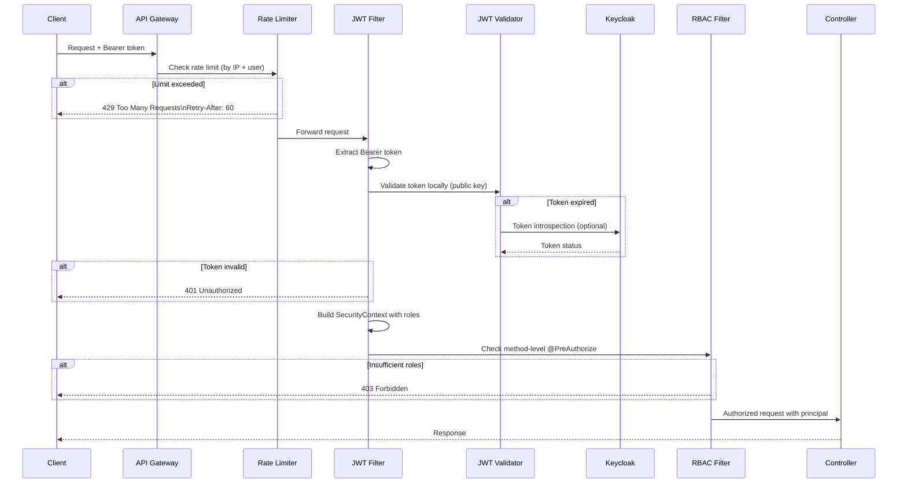

-----

## Security Checklist — Document All of These

### Authentication

□ Mechanism: JWT / OAuth2 / OIDC / API Key — document which
□ Token format: JWT claims documented (sub, roles, exp, iss, aud)
□ Token storage: where client stores it (HttpOnly cookie / memory)
□ Refresh token strategy: rotation / sliding expiry
□ Session invalidation: how logout is handled

### Authorization

□ Authorization model: RBAC / ABAC / Scopes — document which
□ All roles defined in a table with permissions
□ @PreAuthorize / @Secured annotations documented per endpoint
□ Resource-level ownership checks documented

### Transport Security

□ HTTPS enforced everywhere (no HTTP in PROD)
□ HSTS header configured
□ TLS version minimum (1.2 or 1.3)
□ Certificate management documented

### Input Security

□ Bean Validation on all request bodies (@Valid)
□ SQL injection prevented via Spring Data JPA (no native string concatenation)
□ XSS protection headers configured
□ CORS policy documented (allowed origins / methods / headers)
□ File upload limits configured (if applicable)

### Secrets Management

□ No secrets in application.yml — all via env vars or vault
□ Secrets manager reference documented (AWS Secrets Manager / Vault)
□ Key rotation procedure documented

### Data Security

□ PII fields identified and masked in logs
□ Sensitive fields excluded from API responses (passwords, tokens)
□ Data encryption at rest (documented per data store)
□ Audit log coverage documented

-----

## Roles & Permissions Table — Mandatory

|Role         |Description             |Permissions                           |
|-------------|------------------------|--------------------------------------|
|ROLE_ADMIN   |System administrator    |Full access — read/write all resources|
|ROLE_MANAGER |Team manager            |Read all, write own team resources    |
|ROLE_USER    |Standard user           |Read/write own resources only         |
|ROLE_SERVICE |Internal service account|Specific inter-service endpoints only |
|ROLE_READONLY|Audit / reporting user  |Read-only access to all resources     |

-----

-----

# STEP 13 — CONFIGURATION REFERENCE

## Spring Application Properties Documentation

Document ALL properties for each profile:

-----

## Properties Reference Table — Mandatory

|Property                                   |Profile|Required|Default |Range / Values|Description                 |
|-------------------------------------------|-------|--------|--------|--------------|----------------------------|
|server.port                                |all    |❌       |8080    |1024–65535    |HTTP server port            |
|spring.profiles.active                     |all    |✅       |-       |dev,uat,prod  |Active profile              |
|spring.datasource.url                      |all    |✅       |-       |JDBC URL      |PostgreSQL JDBC URL         |
|spring.datasource.hikari.maximum-pool-size |all    |❌       |10      |1–100         |DB connection pool          |
|spring.datasource.hikari.connection-timeout|all    |❌       |30000   |ms            |Pool acquire timeout        |
|spring.jpa.hibernate.ddl-auto              |prod   |✅       |validate|validate,none |PROD: only validate or none!|
|spring.jpa.show-sql                        |dev    |❌       |false   |true,false    |Log SQL — dev only!         |
|spring.flyway.enabled                      |all    |❌       |true    |true,false    |Enable DB migrations        |
|spring.flyway.baseline-on-migrate          |all    |❌       |false   |true,false    |Baseline existing schema    |
|spring.data.redis.host                     |all    |✅       |-       |hostname      |Redis server host           |
|spring.data.redis.port                     |all    |❌       |6379    |1–65535       |Redis server port           |
|spring.kafka.bootstrap-servers             |all    |✅       |-       |host:port     |Kafka broker addresses      |
|spring.kafka.consumer.group-id             |all    |✅       |-       |string        |Consumer group ID           |
|management.endpoints.web.exposure.include  |all    |❌       |health  |* or list     |Actuator endpoints          |
|management.endpoint.health.show-details    |prod   |❌       |never   |never,always  |Health detail level         |
|logging.level.root                         |prod   |❌       |WARN    |TRACE..ERROR  |Root log level              |
|logging.level.com.example                  |prod   |❌       |INFO    |TRACE..ERROR  |App log level               |

-----

## Profile Differences Summary — Mandatory

|Setting           |dev        |uat        |prod    |
|------------------|-----------|-----------|--------|
|ddl-auto          |create-drop|validate   |validate|
|show-sql          |true       |false      |false   |
|Log level         |DEBUG      |INFO       |WARN    |
|Actuator endpoints|*          |health,info|health  |
|Health details    |always     |always     |never   |
|Cache TTL         |60s        |300s       |3600s   |
|Pool size         |5          |10         |20      |
|HTTPS enforce     |false      |true       |true    |

-----

-----

# STEP 14 — TEST ARCHITECTURE DOCUMENTATION

## Test Architecture Diagram

```mermaid
graph TD
  subgraph Unit Tests - No Spring Context
    UT1[Service Unit Tests\nMockito mocks]
    UT2[Repository Unit Tests\n@DataJpaTest]
    UT3[Mapper Unit Tests\nMapStruct]
    UT4[Validator Unit Tests\nBean Validation]
    UT5[Utility Unit Tests\nPure Java]
  end

  subgraph Integration Tests - Partial Context
    IT1[Controller Tests\n@WebMvcTest + MockMvc]
    IT2[Repository Integration\n@DataJpaTest + TestContainers]
    IT3[Service Integration\n@SpringBootTest slices]
    IT4[Kafka Consumer Tests\n@EmbeddedKafka]
  end

  subgraph End-to-End Tests - Full Context
    E1[Full API Tests\n@SpringBootTest + TestContainers]
    E2[Critical Journey Tests\nAuth, Payment, Order flows]
  end

  subgraph Test Infrastructure
    TC[TestContainers\nPostgreSQL, Redis, Kafka]
    WM[WireMock\nExternal API mocks]
    FX[pytest Fixtures\nShared test data builders]
    JC[JaCoCo\nCoverage reporting]
  end

  Unit Tests --> Test Infrastructure
  Integration Tests --> Test Infrastructure
  End-to-End Tests --> Test Infrastructure
```

-----

## Test Coverage Table

|Package    |Line Coverage|Branch Coverage|Critical Paths Tested|Status|
|-----------|-------------|---------------|---------------------|------|
|service/   |88%          |81%            |Payment, Auth, Order |✅     |
|repository/|92%          |85%            |All custom queries   |✅     |
|controller/|79%          |72%            |All endpoints        |⚠️     |
|mapper/    |95%          |90%            |All mappings         |✅     |
|event/     |85%          |78%            |Publish + consume    |✅     |
|util/      |97%          |93%            |All utilities        |✅     |
|batch/     |71%          |65%            |Happy path + error   |⚠️     |

-----

## Test Commands — Document All of These

# Run all unit tests

./mvnw test

# Run with JaCoCo coverage report

./mvnw verify

# Run only integration tests

./mvnw verify -P integration-tests

# Run specific test class

./mvnw test -Dtest=PaymentServiceTest

# View coverage report

open target/site/jacoco/index.html

# Run with TestContainers (requires Docker)

./mvnw verify -P integration-tests -Ddocker.enabled=true

-----

-----

# STEP 15 — DEPLOYMENT ARCHITECTURE

## Deployment Diagram

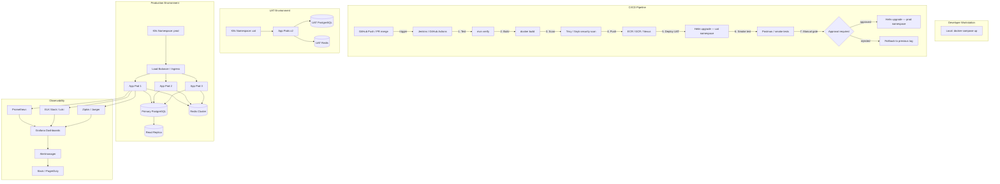

-----

## Deployment Runbook — Mandatory Sections

□ Pre-deployment checklist (migrations ready? config updated? stakeholders notified?)
□ Deployment command (exact helm / kubectl command)
□ Rollback command (exact command — tested and verified!)
□ Post-deployment verification steps
□ Key metrics to watch for 30 mins post-deploy
□ Escalation path if issues found

-----

-----

# STEP 16 — OBSERVABILITY DOCUMENTATION

## Observability Stack Diagram

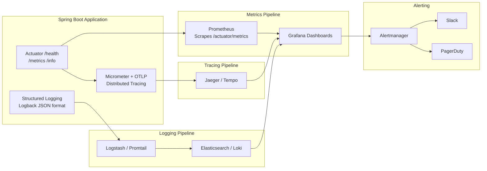

-----

## Key Metrics to Document

|Metric Name                 |Type     |Description               |Alert Threshold|
|----------------------------|---------|--------------------------|---------------|
|http_server_requests_seconds|Histogram|API response time         |p99 > 2s       |
|http_server_requests_total  |Counter  |Total requests by status  |5xx rate > 1%  |
|jvm_memory_used_bytes       |Gauge    |JVM heap used             |> 85% of max   |
|hikaricp_connections_active |Gauge    |DB pool active connections|> 80% of max   |
|kafka_consumer_lag          |Gauge    |Consumer group lag        |> 1000 messages|
|cache_gets_total            |Counter  |Cache hits and misses     |hit ratio < 80%|
|process_cpu_usage           |Gauge    |JVM CPU usage             |> 80% for 5min |

-----

## Structured Log Format — Document Always

Every log line must be JSON with these fields:
{
“timestamp”: “2025-04-12T10:30:00.123Z”,
“level”: “INFO”,
“logger”: “com.example.payment.PaymentService”,
“message”: “Payment initiated successfully”,
“traceId”: “abc123def456”,
“spanId”: “789xyz”,
“correlationId”: “req-uuid-123”,
“userId”: “user-456”,
“orderId”: “order-789”,
“durationMs”: 145,
“environment”: “prod”,
“service”: “payment-service”,
“version”: “1.2.3”
}

Fields that must NEVER appear in logs:
❌ password, passwordHash, token, secret, apiKey,
cardNumber, cvv, accountNumber, ssn, dob

-----

-----

# STEP 17 — ARCHITECTURE DECISION RECORDS (ADR)

## ADR Template — Generate One Per Major Design Decision

docs/decisions/
├── ADR-001-use-postgresql-as-primary-db.md
├── ADR-002-event-driven-async-processing.md
├── ADR-003-jwt-over-session-auth.md
└── ADR-004-flyway-for-db-migrations.md

-----

## ADR Format

# ADR-001: Use PostgreSQL as Primary Database

**Date:** 2025-04-12
**Status:** Accepted
**Deciders:** [Team members involved]

## Context

[What situation or problem forced this decision?]
[What constraints existed? Technical, time, team skill?]

## Decision

[Exactly what was decided — specific and unambiguous]

## Consequences

### Positive

- [Benefit 1]
- [Benefit 2]

### Negative / Trade-offs

- [Trade-off 1]
- [Trade-off 2]

### Risks

- [Risk 1 and mitigation]

## Alternatives Considered

|Option |Pros           |Cons               |Why Rejected             |
|-------|---------------|-------------------|-------------------------|
|MySQL  |Familiar       |Weaker JSON support|Needed JSONB             |
|MongoDB|Flexible schema|ACID complexity    |Strong consistency needed|

-----

Generate ADR for every major decision found in codebase:
□ Choice of database
□ Auth strategy
□ Sync vs async processing
□ Cache strategy
□ API versioning approach
□ Migration tool choice
□ Deployment strategy

-----

-----

# STEP 18 — FINAL DOCUMENTATION QUALITY CHECKLIST

## Before Declaring Documentation Complete

### Diagrams

□ System Context diagram (C4 L1) — renders in Mermaid ✅
□ Container diagram (C4 L2) — renders in Mermaid ✅
□ Component diagram (C4 L3) per major container ✅
□ Package/layer dependency diagram ✅
□ ERD for all JPA entities ✅
□ Request lifecycle sequence diagram ✅
□ Auth/authorization sequence diagram ✅
□ Error handling flowchart ✅
□ Async/event processing sequence diagram ✅
□ Batch job flowchart (if applicable) ✅
□ Circuit breaker state diagram (if applicable) ✅
□ Deployment architecture diagram ✅
□ Observability stack diagram ✅
□ Security filter chain diagram ✅

### Code Documentation

□ All public classes have Javadoc ✅
□ All public methods have Javadoc with @param, @return, @throws ✅
□ All REST controllers have @Operation and @ApiResponse ✅
□ All @Entity classes have field-level comments ✅
□ All configuration properties have @ConfigurationProperties docs ✅
□ package-info.java exists for major packages ✅

### README & Guides

□ README quickstart is copy-paste runnable — tested! ✅
□ All environment variables documented in table ✅
□ Profile differences table present ✅
□ Error codes reference table present ✅
□ Security roles & permissions table present ✅
□ Test coverage table present ✅
□ Index documentation table present ✅
□ Key metrics with alert thresholds documented ✅
□ Log format documented with masked fields listed ✅
□ ADRs written for major design decisions ✅

### Operations

□ Deployment runbook complete ✅
□ Rollback procedure documented and verified ✅
□ Post-deploy verification steps listed ✅
□ Escalation path documented ✅
□ Common troubleshooting scenarios documented ✅

Only then declare:
“Documentation ship ready babu! 🎉☕
Inka junior devs ki onboard cheyyadam easy avutundi!
README chusi ne run cheseyagalaru! 🚀”

-----

-----

# 🧠 QUICK TRIGGER SUMMARY

|Say This                          |Mode Activated                           |
|----------------------------------|-----------------------------------------|
|“analyse spring boot project”     |☕ Full doc mode — assessment first       |
|“document this java project”      |☕ Full doc mode — assessment first       |
|“create spring boot documentation”|☕ Full doc mode — assessment first       |
|“generate project docs”           |☕ Full doc mode — assessment first       |
|“create flow diagram for X”       |Generate Mermaid sequence/flowchart for X|
|“create ERD”                      |Generate Mermaid ERD from entity scan    |
|“document this class”             |Full Javadoc for class + methods         |
|“generate ADR for X”              |Generate ADR template for decision X     |
|“create runbook”                  |Generate operations runbook              |
|“create API docs”                 |OpenAPI + error codes + examples         |

-----

# 📌 NON NEGOTIABLE RULES — ALWAYS APPLY

1. Assessment inventory report FIRST — never write docs blindly
1. Propose documentation structure and get approval before writing
1. ALL diagrams in Mermaid syntax — renders natively in GitHub/GitLab
1. C4 model strictly: Context → Container → Component → Code
1. Every flow must cover happy path AND all error paths
1. README quickstart must be copy-paste runnable — no exceptions
1. Environment variables table is mandatory in every project
1. Profile comparison table (dev/uat/prod) is mandatory always
1. Security checklist must be fully documented
1. Javadoc on ALL public classes and methods — no skipping
1. ADR for every major architectural decision found
1. Test coverage table mandatory in every documentation set
1. Deployment + rollback procedure must be explicitly documented
1. Sensitive fields must be explicitly listed as masked in logs
1. Final quality checklist must be completed before sign-off

-----

*“Documentation ekdam legendary ga unndi babu! 🎉☕🚀*
*Mee project inka professional ga kanipisthundi!”*
